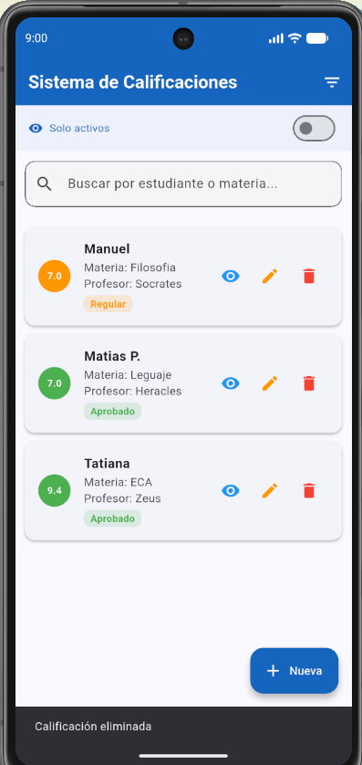
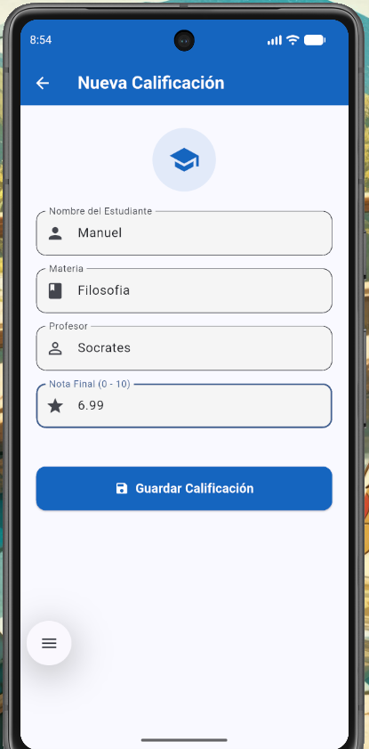
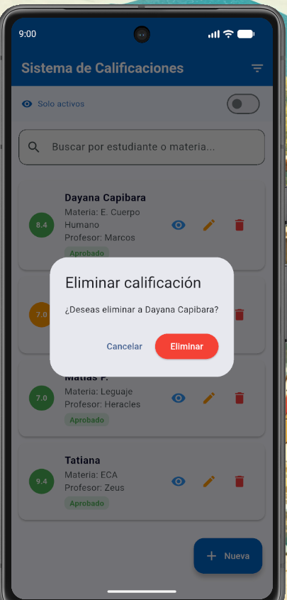
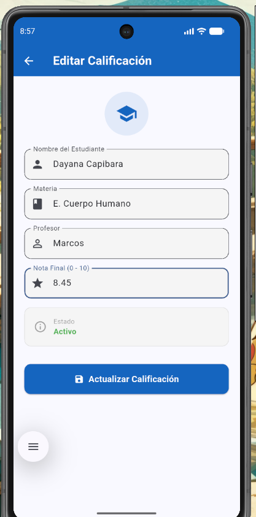
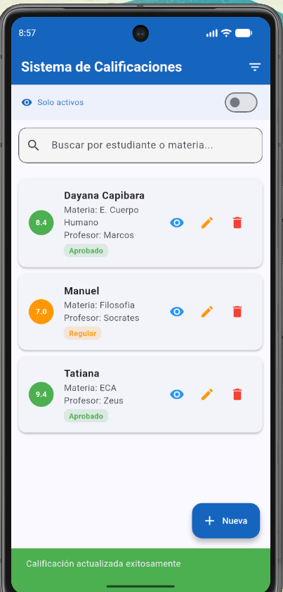
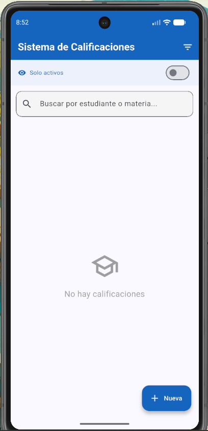
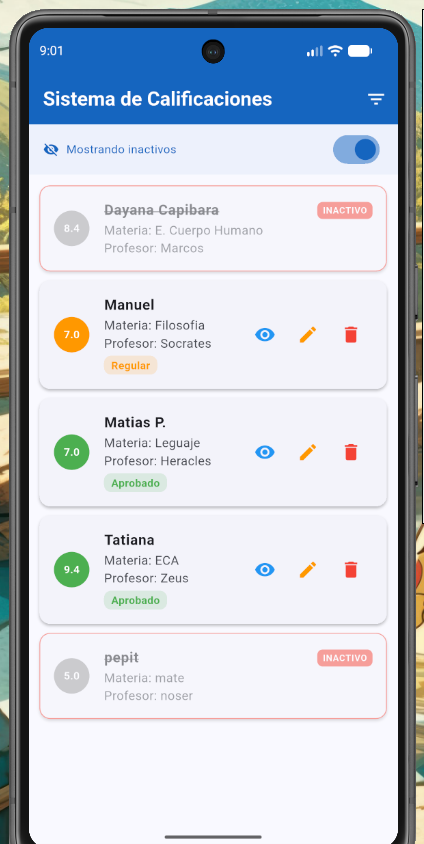
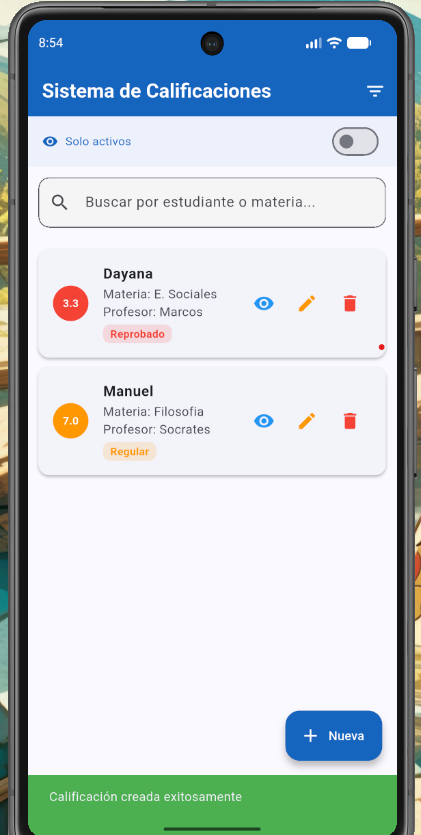

# 📚 Sistema de Calificaciones

Aplicación móvil desarrollada en **Flutter** para gestionar calificaciones estudiantiles.

## 🚀 Tecnologías utilizadas
- Flutter (Dart)
- SQLite (sqflite) — persistencia local
- Provider — gestión de estado (patrón MVVM)
- Material Design 3

## 📋 Funcionalidades
- ✅ Listar calificaciones activas
- ✅ Crear nueva calificación
- ✅ Ver detalle de calificación
- ✅ Editar calificación existente
- ✅ Eliminación lógica (estado A = Activo / I = Inactivo)
- ✅ Switch para ver registros inactivos
- ✅ Búsqueda por nombre de estudiante o materia
- ✅ Filtro por rango de nota (Aprobado / Regular / Reprobado)

## 📸 Screenshots

### Mensaje de eliminación


### Crear nueva calificación


### Eliminación De nota 


### Edición nota


### Mensajes de confirmación de edición 


### Lista vacía


### Filtro de notas


### Registros inactivos


### Mensajes de verificación


## 🎨 Decisiones de diseño

- **Flutter + Provider** fue elegido sobre Android nativo por su menor complejidad de versionamiento y rapidez de desarrollo.
- **Eliminación lógica** con campo `estado` (A/I) para mantener historial de registros sin borrarlos físicamente.
- **Colores por rendimiento:** verde (aprobado 7-10), naranja (regular 5-6.99) y rojo (reprobado 0-4.99) para identificar visualmente el estado académico.
- **Provider como ViewModel:** separa completamente la lógica de negocio de la UI, siguiendo el patrón MVVM.
- **SQLite local** para persistencia sin necesidad de internet ni servidor externo.

## 🗂 Estructura del proyecto
```
lib/
├── main.dart
├── database/
│   └── database_helper.dart
├── models/
│   └── calificacion.dart
├── providers/
│   └── calificacion_provider.dart
└── screens/
    ├── lista_screen.dart
    └── detalle_screen.dart
```

## 🛠 Cómo correr el proyecto
1. Clona el repositorio
2. Ejecuta `flutter pub get`
3. Ejecuta `flutter run`

## 📊 Modelo de datos
| Campo | Tipo | Descripción |
|---|---|---|
| id | INTEGER | Auto incrementable |
| nombreEstudiante | TEXT | Nombre del estudiante |
| materia | TEXT | Materia cursada |
| profesor | TEXT | Nombre del profesor |
| notaFinal | REAL | Nota entre 0 y 10 |
| estado | TEXT | A = Activo, I = Inactivo |

## 🎯 Versión
- Flutter 3.41.4
- Android API 36
- Dart SDK 3.x